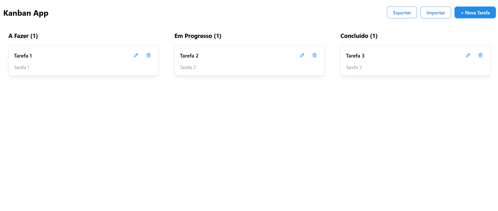

# Desafio - Kanban App

Esse projeto é um desafio proposto pela equipe do Estúdio Haus para aplicação front-end. Gostei bastante de implementar essa aplicação e agradeço pelo desafio!

---

<p align="center">
  <a href="#-visão-geral">Visão Geral</a>&nbsp;&nbsp;&nbsp;|&nbsp;&nbsp;&nbsp;
  <a href="#-executando-o-projeto">Executando o Projeto</a>&nbsp;&nbsp;&nbsp;|&nbsp;&nbsp;&nbsp;
  <a href="#-projeto">Projeto</a>&nbsp;&nbsp;&nbsp;|&nbsp;&nbsp;&nbsp;
  <a href="#-tecnologias">Tecnologias</a>
</p>

---

## 👀 Visão Geral



---

## 🚀💻 Executando o Projeto

Clone o projeto e acesse a pasta:

```bash
git clone https://github.com/Lorena-Avelino/Kanban-App.git

cd Kanban-App
```
Instale as dependências e rode o projeto:

```bash
npm install
npm run dev
```
O projeto estará executando em: http://localhost:5173/

---

## 💻 Projeto
Funcionalidades principais
- Criar, editar e excluir tarefas

- Modal para criação/edição (Mantine)

- 3 colunas: A Fazer, Em Progresso, Concluído

- Drag-and-drop de tarefas entre colunas e dentro da mesma coluna (@hello-pangea/dnd)

- Persistência em LocalStorage

- Exportar e importar tarefas em JSON

- Contador de tarefas por coluna

- Notificações de sucesso/erro (Mantine Notifications)

- Confirmação antes de excluir (Mantine Modals)

- Layout responsivo (desktop e mobile)
---

## Componentes principais
- <details> <summary><strong>TaskCard</strong></summary> Cartão individual da tarefa, exibe título, descrição e botões de editar/excluir.
</details>

- <details> <summary><strong>TaskColumn</strong></summary> Coluna do Kanban, renderiza as tarefas de um status específico e integra com drag-and-drop.
</details>

- <details> <summary><strong>TaskForm</strong></summary> Formulário usado dentro do modal para criar e editar tarefas.
</details>

- <details> <summary><strong>TasksContext</strong></summary> Contexto global que gerencia o estado das tarefas (criar, editar, remover, mover) com persistência em LocalStorage.
</details>

## Extras

- Exportação/Importação 
  - Permite salvar todas as tarefas em um arquivo JSON e restaurar esse backup.
  - A importação valida os dados antes de atualizar o estado.

- Notificações
  - Exibe feedbacks de sucesso/erro em cada ação do usuário (criar, editar, excluir, exportar, importar).

- Modal de Confirmação
  - Antes de excluir uma tarefa, abre um modal de confirmação para evitar exclusões acidentais.

## 🚀 Tecnologias

Esse projeto foi desenvolvido com as seguintes tecnologias:

- ⚛️ React

- 🔷 TypeScript

- 🎨 TailwindCSS

- 🎛️ Mantine (UI, modals, notifications)

- 📦 @hello-pangea/dnd (drag & drop)

- 💾 LocalStorage

- ⚡ Vite

## 📚 Aprendizados
Este projeto foi meu primeiro contato com **Mantine** e **TailwindCSS**.  
- Com **Mantine**, explorei modais, formulários, notificações e componentes prontos.  
- Com **TailwindCSS**, aprendi a aplicar utilitários de forma rápida para responsividade e layout.  
- Também aprofundei meu entendimento em **React Context** para centralizar estado e em bibliotecas de **drag-and-drop**.  

Esse desafio me ajudou a praticar boas práticas de organização e a criar uma aplicação completa do zero.

## 🧩 Decisões Técnicas
- Usei **React Context + hook customizado (useTasks)** para manter consistência no estado.  
- A biblioteca **@hello-pangea/dnd** foi escolhida no lugar de `react-beautiful-dnd` pela melhor compatibilidade com React 18+.  
- Mantive o modal como componente reaproveitável, permitindo tanto criar quanto editar tarefas.  
- Optei por persistência em **LocalStorage** para simplificar a solução (sem backend).  

